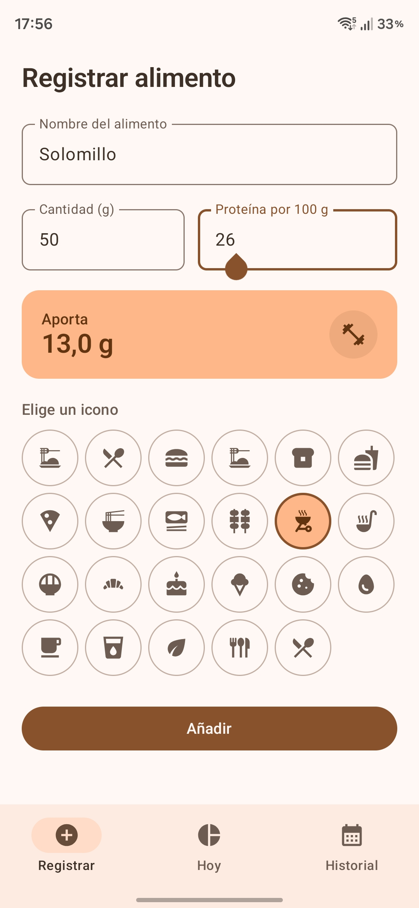
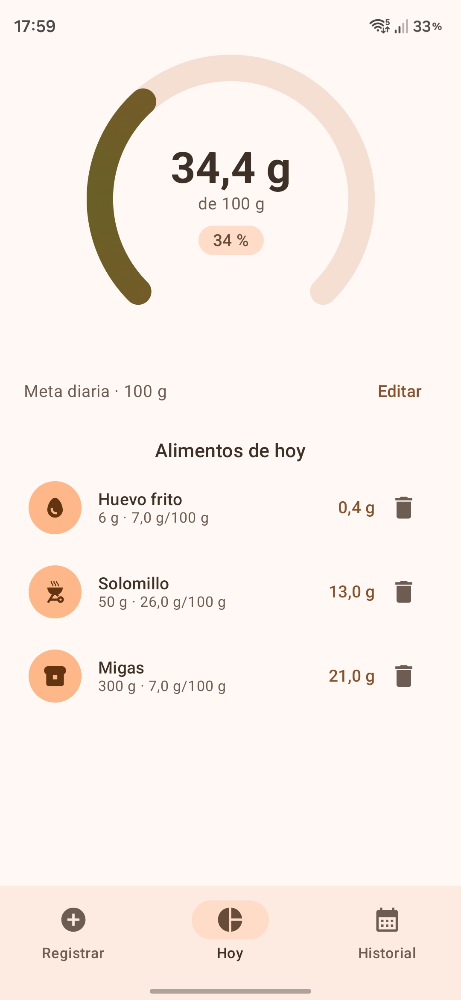
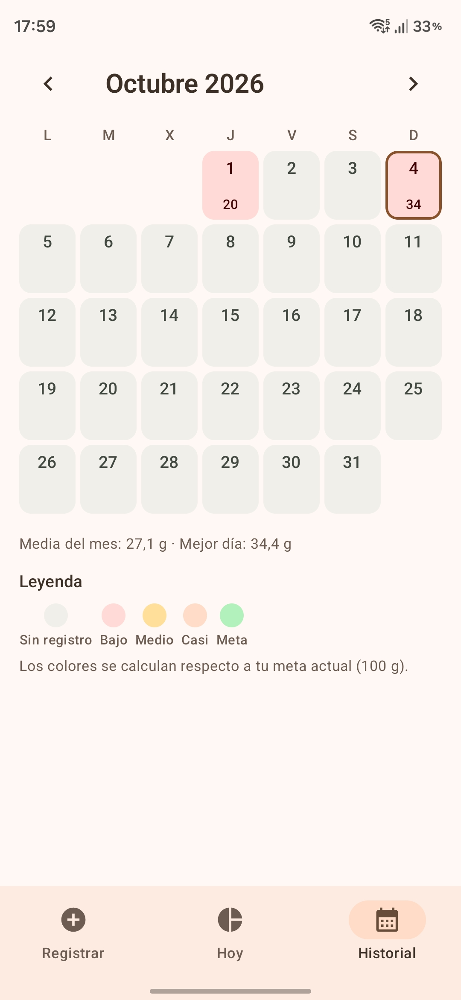

# Protein Tracker

App de Android para registrar la proteína que consumes cada día y ver tu progreso.

- **Kotlin** · **Jetpack Compose** · **Material Design 3** con **Dynamic Color** (Material You)
- **Room** para el registro de alimentos, **DataStore** para la meta diaria
- MVVM con `StateFlow`, un único `ViewModel` compartido entre las tres pestañas
- Interfaz completamente en español, `minSdk 26` / `targetSdk 35`

---

## Abrir el proyecto

1. Android Studio → **Open** → selecciona esta carpeta (`aplicacion-proteinas`).
2. Espera a que termine el *Gradle Sync*. Android Studio crea `local.properties` con tu
   `sdk.dir` automáticamente.
3. Pulsa ▶ para instalar en el dispositivo o emulador.

El proyecto incluye el Gradle wrapper completo (`gradlew` + `gradle/wrapper/gradle-wrapper.jar`),
así que no necesitas tener Gradle instalado.

### Requisitos

| | |
|---|---|
| Android Studio | Giraffe 2023.2 o superior (para AGP 8.7) |
| JDK | 17 o 21 (el que incluye Android Studio) |
| Gradle | 8.9 (vía wrapper) |

> Si tu Android Studio es anterior a Giraffe, baja la versión de AGP en `build.gradle.kts`
> a `8.5.2` y `compileSdk` a `34`.

---

## Las tres pestañas

### 1 · Registrar

Formulario para añadir un alimento:

- **Nombre del alimento**
- **Cantidad (g)**
- **Proteína por 100 g**
- **Icono** — obligatorio, de una lista precargada de 26 iconos (Pollo, Pizza, Huevo, Café…)

Mientras escribes, una tarjeta calculates **cuánta proteína aporta** ese alimento. El icono se
guarda como clave de texto (`grill`, `egg`, …), así que puedes reordenar o ampliar la lista en
`ui/icons/FoodIcon.kt` sin tocar los datos ya guardados.

Se aceptan `,` o `.` como separador decimal (`150`, `31,5`).

### 2 · Hoy

- **Anillo circular** con el total del día, la meta y el porcentaje alcanzado. Se anima al
  registrar y respira suavemente cuando llegas al objetivo.
- **Meta diaria** editable (100 g por defecto).
- Lista de los alimentos de hoy: toca la fila para **editar**, o el icono de papelera para
  **eliminar** (con opción de **Deshacer**).
- Botón para saltar a la meta diaria cuando hay objetivo cumplido.

### 3 · Historial

Calendario mensual que empieza el **lunes** (L M X J V S D), con navegación entre meses.

Cada día se colorea según tu **meta actual**:

| | Color |
|---|---|
| Sin registro, o día futuro | Gris neutro |
| Menos del 40 % | Rojo (error) |
| 40 – 74,9 % | Ámbar (warning) |
| 75 – 99,9 % | Verde claro (secondary) |
| 100 % o más | Verde (success) + check |

Debajo del calendario: media del mes, mejor día y la leyenda de colores.

Toca cualquier día pasado para abrir una hoja inferior con ese día concreto, su total, una barra
de progreso y la lista de alimentos (también editables y eliminables).

> Los colores se recalculan contra la meta vigente, así que si cambias la meta se repinta todo el
> historial.

### Celebración

La primera vez que el total del día alcanza la meta, aparece un diálogo con confeti animado. Como
se guarda el día en DataStore, **solo aparece una vez al día**.

---

## Estructura

```
app/src/main/java/com/proteintracker/
├── MainActivity.kt
├── ProteinTrackerApp.kt              Application + AppContainer (DI manual)
├── data/
│   ├── local/                        Room: ProteinEntry, ProteinDao, ProteinDatabase
│   └── repository/                   ProteinStore, SettingsStore + implementaciones
├── domain/
│   ├── ProteinMath.kt                cálculos, bandas de color, rejilla del calendario
│   ├── Formatting.kt                 formato español (85,2) y fechas
│   └── DateKeys.kt                   LocalDate <-> "yyyy-MM-dd"
└── ui/
    ├── theme/                        Dynamic Color, ExtendedColors, tipografía, formas
    ├── icons/FoodIcon.kt             catálogo de iconos precargados
    ├── components/                   ProteinRing, FoodIconPicker, EntryRow,
    │                                 ConfettiBurst, CelebrationDialog, GoalDialog, DayDetailSheet
    ├── screens/                      LogFoodScreen, CounterScreen, HistoryScreen
    ├── ProteinViewModel.kt
    ├── ProteinUiState.kt
    └── ProteinTrackerRoot.kt         Scaffold + NavigationBar + navegación
```

### Notas de diseño

- **`dayKey` desnormalizado** (`yyyy-MM-dd`, indexado) en `ProteinEntry`: permite que el
  calendario consulte un mes con un solo rango indexado, y que `SUM()` funcione en SQL.
  Como el formato es ordenable lexicográficamente, un `BETWEEN` de texto también es un rango
  cronológico.
- **`ExtendedColors`**: Dynamic Color solo puede redefinir los roles de M3, así que los colores
  semánticos (success / warning) viven en un `CompositionLocal` propio que cambia con el tema
  claro/oscuro. Así el mapa de calor del calendario sigue siendo legible con cualquier fondo.
- **`ProteinUiState`** se construye combinando flujos con `stateIn(WhileSubscribed)`, así que no
  hay estado duplicado entre pestañas.
- **Cambio de día / zona horaria**: `refreshToday()` se dispara en `ON_RESUME`, de modo que la app
  no se queda anclada a ayer tras pasar medianoche.

---

## Tests

```bash
./gradlew :app:testDebugUnitTest
```

30 tests JVM, sin emulador:

- **`ProteinMathTest`** — cálculo de proteína, ratio, límites exactos de las 4 bandas
  (39,9/40, 74,9/75, 99,9/100), días futuros nunca coloreados, formato español.
- **`CalendarGridTest`** — rejilla de lunes, los 12 meses de 2026, meses de 6 filas, año bisiesto.
- **`ProteinViewModelTest`** — altas, ediciones, borrados y deshacer; el objetivo mensual; y que
  la celebración salte **una sola vez al día** (también al bajar y volver a subir la meta).

## Lint

`./gradlew :app:lintDebug` → **0 errores**. Quedan avisos informativos:

- `GradleDependency` (11): hay versiones más nuevas disponibles. Se mantienen las actuales a
  propósito, porque las últimas exigen `compileSdk 36` y/o un AGP más reciente.
- `ObsoleteSdkInt` (1): sugiere renombrar `mipmap-anydpi-v26` a `mipmap-anydpi` por ser
  `minSdk 26`. **No lo hagas**: AAPT2 falla al resolver `adaptive-icon` sin el calificador de
  versión.

## Permisos

Ninguno. Todo se guarda localmente en el dispositivo (Room + DataStore).

## UI




